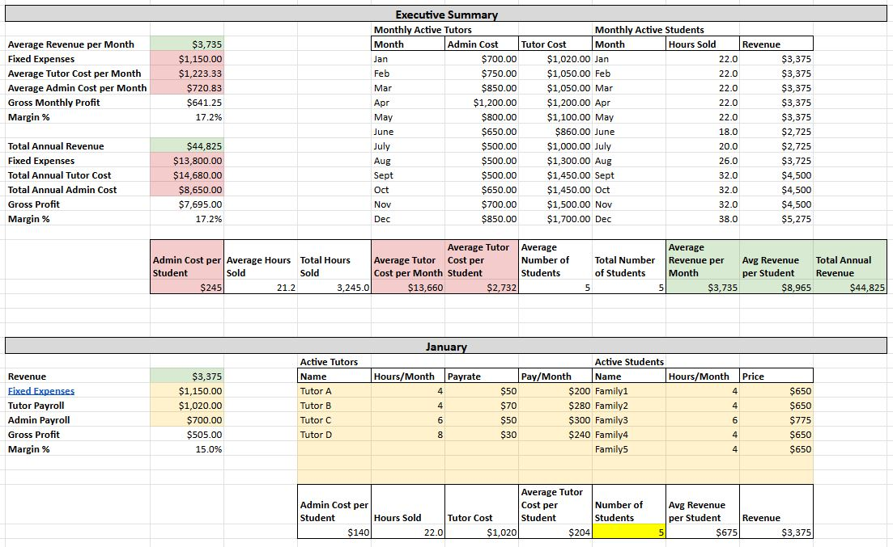
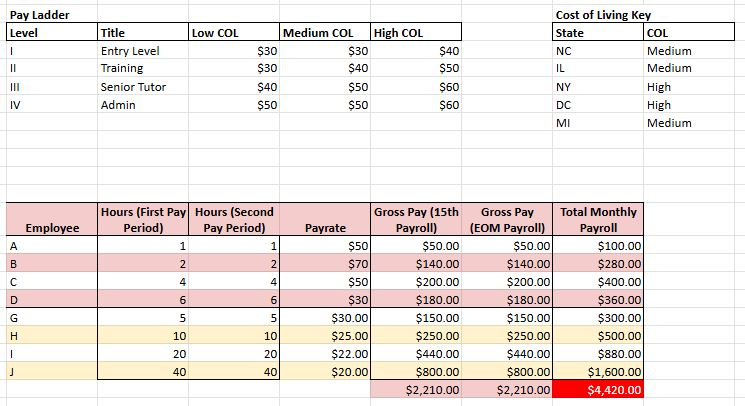
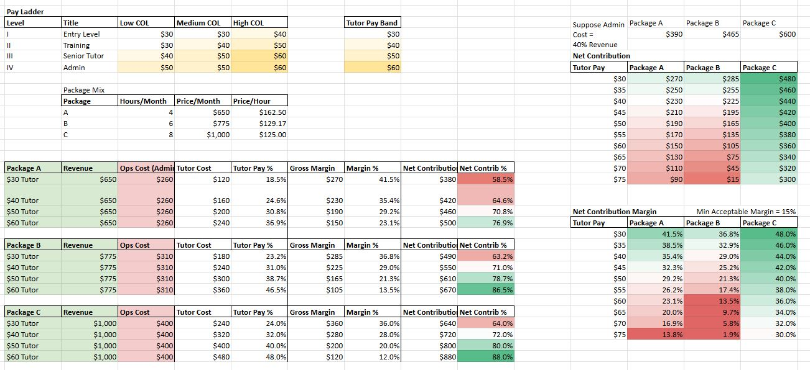
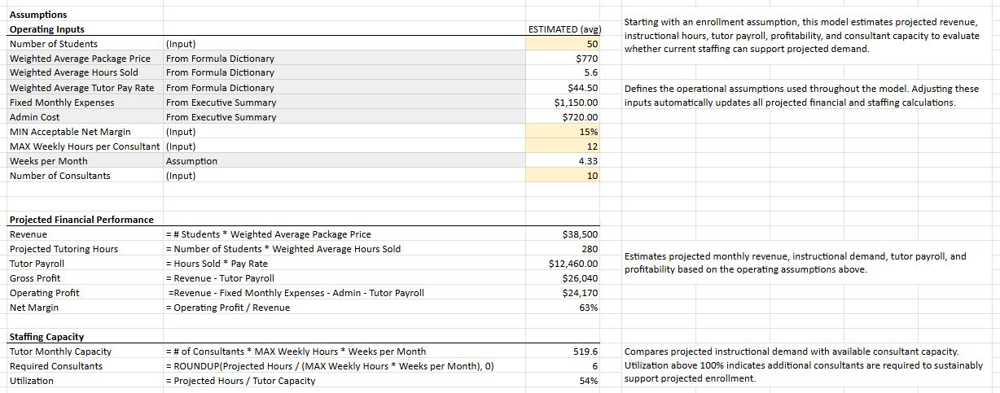

# Educational Services Capacity Planning Model

This project is a financial and staffing planning model built in Excel / Google Sheets for an educational services organization.

The model combines financial forecasting with operational capacity planning to help estimate staffing needs, instructional workload, and projected profitability under different enrollment assumptions.

## Business Questions

This model was designed to help answer questions such as:

- How many consultants are required to support projected enrollment?
- What tutor payroll should be expected?
- How does enrollment affect profitability?
- Is the current consultant team operating within sustainable capacity?
- How efficiently are consultant hours being utilized?

## Current Features

- Monthly revenue forecasting
- Projected tutoring hours
- Tutor payroll estimation
- Gross profit and operating profit calculations
- Net margin calculation
- Consultant capacity analysis
- Consultant utilization analysis
- Administrative cost tracking
- Dynamic assumption-driven financial model

## Planned Enhancements

- Enrollment scenario planning
- Goal Seek analysis for target profitability
- Sensitivity analysis for staffing and pricing assumptions
- Solver optimization for staffing decisions
- Executive dashboard enhancements

---

## Executive Summary

## Payroll Worksheet

## Profitability Model

## Capacity Planning Model

---

## Skills Demonstrated

- Financial Modeling
- Business Analytics
- Capacity Planning
- Workforce Planning
- Operational Forecasting
- Excel / Google Sheets
- Spreadsheet Model Design
- Executive Reporting
